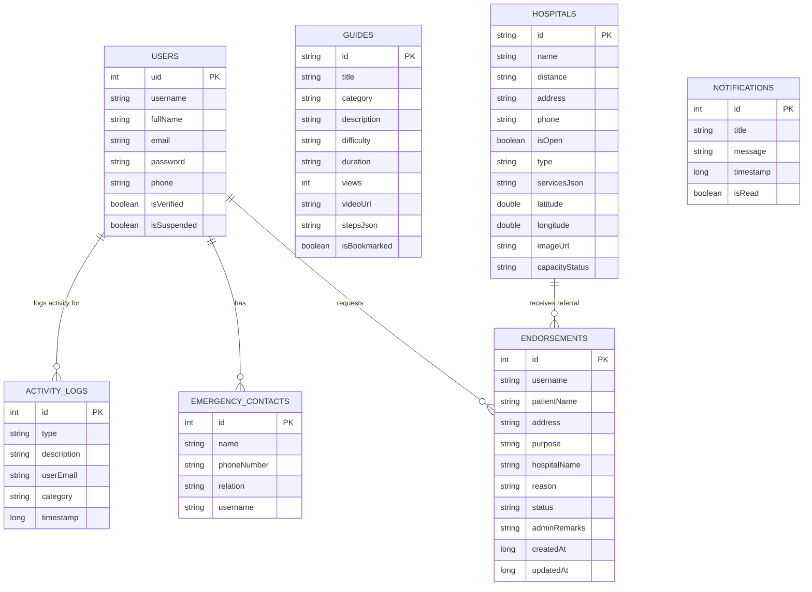

# InstaCare Local Database ERD

This document provides a visual representation and detailed schema of the local Room database used in the InstaCare application.

## Entity-Relationship Diagram

## Detailed Table Descriptions

### 1. USERS (`users`)
Stores user account information including credentials and status.

### 2. ACTIVITY_LOGS (`activity_logs`)
Tracks user actions such as logins, profile updates, and SOS alerts. Linked to users via `userEmail`.

### 3. EMERGENCY_CONTACTS (`emergency_contacts`)
Stores per-user emergency contacts. Linked to users via `username`.

### 4. ENDORSEMENTS (`endorsements`)
Referrals or medical assistance requests created by users for specific hospitals.
- **Relationships**: Linked to `USERS` via `username` and `HOSPITALS` via `hospitalName`.

### 5. GUIDES (`guides`)
First aid instruction data (Bleeding, Cardiac, Burns, etc.). Seeded from `AppDatabase`.

### 6. HOSPITALS (`hospitals`)
Information about local hospitals and clinics, including capacity status and location. Seeded from `AppDatabase`.

### 7. NOTIFICATIONS (`notifications`)
Stores alerts and system notifications for the local user.
